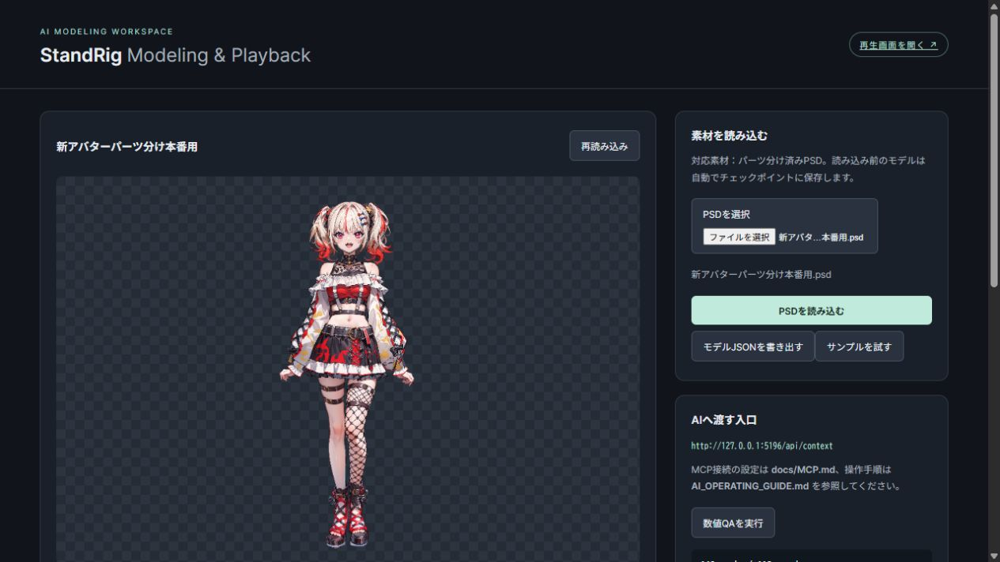

# StandRig

[日本語](README.md) | [English](README.en.md)

**A 2D modeling core that AI can edit, with an embeddable playback runtime.**

Import a PSD with separate artwork layers, edit meshes, deformers and keyforms through an MCP-compatible AI client, and drive the model with numeric parameters. A browser UI is included for PSD import and visual checks. This is an early developer release, **0.2.0**.



This is an actual screenshot of an imported character PSD. The character's PSD and model are not included. The “Try sample” button loads a geometric model. The screenshot uses test port 5196; the default service port is 5180. See the [screenshot artwork notice](docs/images/NOTICE.md).

## Features and scope

| Feature | Support |
| --- | --- |
| Artwork import | Image layers, positions, hierarchy and other supported properties from a parts-separated PSD |
| Modeling | Edit, dry-run, run numeric QA, commit and restore through MCP / HTTP APIs |
| Playback | Transparent player page, numeric parameter input and an embeddable browser runtime |
| Tracking | Receive numeric values from external tracking tools; camera inference is not bundled |
| OBS | Use the player page as a Browser Source in an external OBS installation; OBS control is not bundled |
| Live2D / Cubism | A bridge is a future extension. Creating, converting or playing cmo3/moc3 files is currently unsupported |

**Importing a PSD does not automatically create a finished rig or its movements.** Ask your AI client to create the required settings, then inspect the actual result. Automatic part separation, AI models and image generation services are not provided.

## Quick start

You need **Node.js 22.x starting at 22.12, or Node.js 24 or later**, and a browser. The locally tested environment is Windows with Node.js 24. Initial dependency installation requires an internet connection. Viewing the sample and using the sliders do not require an AI subscription or MCP connection.

The browser UI currently uses Japanese labels. The steps below include the exact labels and their English meanings. Some linked guides are also in Japanese.

### 1. Get the files

Clone this repository with GitHub Desktop, or choose **Code → Download ZIP** and extract it. You can also use a source ZIP if one is published under Releases.

Open the folder containing `README.md`, `package.json` and `start-modeling-tools.cmd`. Extract the ZIP before running anything inside it.

### 2. Start the service

**Windows:** With a supported Node.js version already installed, double-click `start-modeling-tools.cmd`. It installs npm dependencies on first use, builds the project and starts the service. Keep the command window open while using StandRig. This launcher does not install Node.js.

**From a terminal:** Change to the repository folder and run:

```sh
npm ci
npm run build
npm start
```

When you see `StandRig local service: http://127.0.0.1:5180`, open **http://127.0.0.1:5180/** in your browser. The browser does not open automatically.

### 3. Try the sample

1. Click **「サンプルを試す」 (Try sample)**. The current model is saved to a checkpoint before it is replaced.
2. Click **「再生画面を開く」 (Open player)**.
3. Scroll down in the original page and move sliders such as **Angle Z** (`ParamAngleZ`, head tilt) and **Mouth** (`ParamMouthOpen`, mouth opening). Check that the player page reflects the changes.

The sample is a geometric model. Parameters without bindings will not produce movement. **「再生」 (Play)** advances time and physics; it does not start automatic gestures or camera tracking.

## Import your PSD

1. Click **「PSDを選択」 (Select PSD)**, choose one file, then click **「PSDを読み込む」 (Import PSD)**.
2. Check the positions, stacking order, colors and visibility against your intended artwork.
3. Connect your AI client and describe the parts you want to move and their intended ranges.

Input is **PSD only**, with at least two image layers containing artwork. Direct PNG import, flattened or single-layer PSDs, PSB files and automatic part separation are unsupported. Layer count alone cannot establish whether artwork is separated appropriately. Not all Photoshop features are reproduced. See the [PSD input guide](docs/PSD.md).

## Connect an AI client

Use a separate AI client that supports stdio MCP. AI subscriptions, fees and tool execution settings are managed by that client. Keep the StandRig service running.

For clients that accept the `mcpServers` format, add the following configuration. Replace `args` with the **absolute path** to your copy of StandRig.

```json
{
  "mcpServers": {
    "standrig": {
      "command": "node",
      "args": ["C:/path/to/StandRig/packages/mcp/src/cli.mjs"],
      "env": { "STANDRIG_URL": "http://127.0.0.1:5180" }
    }
  }
}
```

Configuration locations and formats vary by client. See the [MCP setup guide](docs/MCP.md) for connection checks.

Example first prompt:

> Read StandRig's MCP resources standrig://docs/contract and standrig://docs/guide. Use standrig_context to inspect the current model and explain its parts and configured movements. Do not modify the model yet.

Example modeling request:

> Start by setting up eye opening and closing for this PSD. Inspect the existing part IDs and structure. Follow the modeling contract to prepare the required reference images and manifest before editing, then proceed through dry-run, numeric QA, commit and actual visual inspection. If you cannot prepare the references with your available tools, explain what materials are needed.

MCP alone cannot paint new reference images or save arbitrary files. Use the AI client's file and image tools, or materials supplied by the operator. Passing numeric QA does not establish visual completion. See the [AI operating guide](AI_OPERATING_GUIDE.md) and [modeling contract](AGENTS.md).

## Save, restore and share models

- Imports and committed edits are saved on the server. Slider values and playback state are transient and do not edit the model.
- The default data directory is **`workspace/`**: the model is stored in `workspace/public/rig.json`, recovery checkpoints in `workspace/checkpoints/`, and exported bundles in `workspace/exports/`.
- A checkpoint is created before PSD/sample imports and before MCP commits. List checkpoints with `standrig_checkpoint`, then call `standrig_restore` with the checkpoint ID and current revision.
- **「モデルJSONを書き出す」 (Export model JSON)** exports JSON alone. To include images, use `standrig_export` with the **bundle** format. See the [API guide's bundle reimport instructions](docs/API.md#bundleの再読み込み).
- Back up the original PSD and reference images separately. `workspace/` is excluded from Git and distribution ZIPs, so pushing the repository does not back up your model data.

To use a separate data directory for another model:

```sh
npm start -- --data-dir "C:/Models/My Character"
```

Do not run multiple services against the same data directory. Stop the service with **Ctrl+C** in its command window. Use the launcher or `npm start` to restart it. After updating the source, rerun `npm ci` and `npm run build`.

## Troubleshooting

| Symptom | What to check |
| --- | --- |
| `node` / `npm` not found | Install a supported Node.js version, then reopen your terminal or AI client |
| PowerShell blocks `npm.ps1` | Use `npm.cmd ci` and other `.cmd` commands, or use the Windows launcher |
| Page does not open / `fetch failed` | Check that the service is running and the URL and port match |
| `EADDRINUSE` | Check for an already-running service. To use another port, run `npm start -- --port 5182` and update both browser and MCP URLs to port 5182 |
| MCP cannot find `node` | Set `command` to the absolute path of the Node executable |
| Protocol error immediately after MCP connection | Use `node` with `cli.mjs` as shown above, rather than `npm run mcp` |
| PSD is visible but does not move | Check the parameter bindings; PSD import alone does not create a finished rig |
| `empty-image` | Import a PSD or load the sample; an empty model fails QA |
| `revision mismatch` | Fetch the latest context, review your intended changes and retry the dry-run |

## Development

```text
packages/core/       Model types, modeling, evaluation and QA
packages/runtime/    Browser playback and external input contracts
packages/mcp/        Stdio MCP server for AI tools
apps/service/        Local API, persistence, recovery and playback state
apps/preview/        PSD import, pose inspection and transparent player
examples/            Synthetic sample model and integration examples
```

`core` and `runtime` can be used without MCP. The packages are not published to npm; develop with the npm workspaces in this source tree. See the [architecture](docs/ARCHITECTURE.md), [adapters and embedding](docs/ADAPTERS.md), [API guide](docs/API.md) and [operation reference](docs/OPERATIONS.md).

```sh
npm run build
npm test
```

For UI development, keep the service running on port 5180, run `npm run dev` in another terminal, and open http://127.0.0.1:5181/. Normal startup uses a standalone Node.js service, independent of Vite.

Use `npm run verify` to check the distribution's file hashes. Source edits will cause mismatches, so this is separate from normal development tests. See [release instructions](docs/RELEASING.md) for packaging and verification, and [validation notes](docs/VALIDATION.md) for tested behavior and remaining limits.

## License

Original code, documentation text and synthetic samples are licensed under [Apache-2.0](LICENSE). See [NOTICE](NOTICE) and the [third-party notices](THIRD_PARTY_NOTICES.md). This repository's license does not apply to imported PSDs, character artwork, or the character shown in the screenshot. See the [screenshot artwork notice](docs/images/NOTICE.md).
