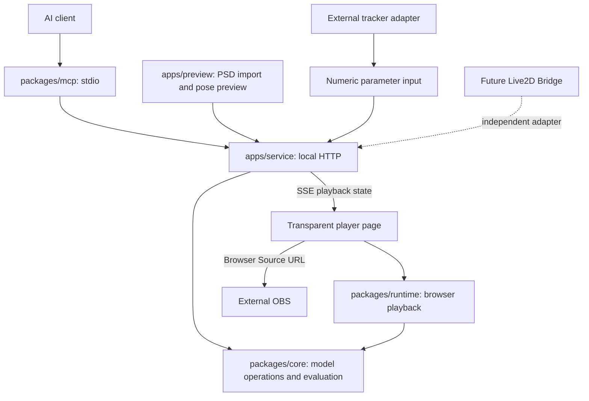

# Architecture

StandRig is a local modeling and playback engine with an MCP adapter. The engine does not require an AI provider or MCP client. Version 0.2.0 is an initial developer release.



## Modules and dependencies

| Module | Responsibility | Imports |
| --- | --- | --- |
| `packages/core` | Model types, mesh/deformer operations, shared evaluator, validation, numeric QA and file-format utilities | pako for PNG; ag-psd only for the optional browser PSD importer |
| `packages/contracts` | Generated strict operation/QA schemas shared by HTTP and MCP; audited legacy method policy | Zod; core declaration types |
| `packages/runtime` | Canvas/WebGL renderer, `StandRigPlayer`, playback and adapter contracts | core; no MCP, Vite, camera or OBS dependency |
| `apps/service` | Model storage, HTTP API, serialized model requests, checkpoints, transient playback state, static preview serving | core, runtime; Node built-ins |
| `packages/mcp` | Validated tools and documentation resources over stdio | Official MCP SDK and Zod; communicates with the local service by HTTP |
| `apps/preview` | Parts-separated PSD import, simple pose controls, transparent player | core, runtime; Vite is build/dev tooling only |

The `core` root export is headless. Browser-specific helpers (`core/importers`, `core/io`) and Node-specific helpers (`core/serverRenderer`, filesystem QA) are explicit subpath imports. These helpers are not interchangeable across environments. The numerical evaluator and modeling operations themselves do not call the PSD parser or MCP SDK. This is a package boundary, not a claim that every module in core has zero external dependencies.

Public entry points are `@standrig/core`, `@standrig/runtime` and their documented types. Other core subpaths expose the extracted implementation and may change during 0.x. Workspace packages are private to avoid accidental npm publication; their source is usable under Apache-2.0.

## Commands versus continuous input

MCP controls modeling transactions, QA, checkpoints, export, playback poses and play/pause/reset. It is not used for every tracking frame.

The runtime also contains the original application's Showcase Fast & Wide and Mouse + Expressions choreography. The service schedules these optional demos and publishes transient poses over SSE; both preview and player use `StandRigPlayer` for rendering and physics. Demo state is additive under `playback.demo`; manual input stops a demo and restores its starting pose before applying the new input.

An in-process tracker calls `player.setParameters(values)`. A separate process posts mapped numeric frames to `/api/playback/parameters`. The service broadcasts the latest state over SSE; browser outputs render locally. Sequence numbers reject duplicate/out-of-order frames for each input source. The last accepted value wins **per parameter** across sources. There is no blending or priority scheduler yet.

Playback state is memory-only. Parameter changes never write keyforms or `rig.json`. Reset restores the model's saved preview/default values; it does not erase source sequence counters. Model reload resets values and sequence counters. Server restart resets transient playback state. `connectedOutputs` measures open SSE connections, including the preview UI; it does not prove a rendered frame or OBS capture. `outputAcknowledged` remains false in this release.

Each service session has a unique `sessionId`. Outputs compare both `sessionId` and `modelVersion` when deciding to reload assets: `modelVersion` alone restarts at zero and cannot identify a new service process. While paused, parameter updates still display a new pose; pause stops continuous time/physics updates, not input reception. Play does not generate motion without time-dependent bindings or external input.

## Storage

Default data directory: `workspace/`, excluded from Git and releases. `npm start -- --data-dir /absolute/project` selects another directory. A new directory is initialized from `templates/` without replacing an existing model.

```text
workspace/
  public/rig.json           current working model
  public/assets/            externalized model textures
  public/goldens/           model-specific QA baselines
  checkpoints/             self-contained restoration snapshots
  exports/                 portable model bundles
  references/              operator-created target sheets and manifest
```

One service process owns one data directory. Do not start two processes against the same directory. `rigApiPlugin.ts` registers guarded route groups. `routes/transactionRoutes.ts` handles HTTP transport; `application/modelingService.ts` owns operations/import/restore, validation, QA, SHA-256 revision comparison, rollback checkpoints and atomic replacement. `application/context.ts` owns paths and the per-service memory journal. `modelingSupport.ts` contains shared model/file helpers. Legacy handlers are grouped by assets, analysis, modeling and rig reads/compatibility.

Legacy writes are off by default; only GET and audited read-only POST handlers pass the guard. `--allow-legacy-writes` explicitly enables compatibility bypasses outside the new guarantees. Append-only checkpoint/export creation is separate from active-model editing. Successful commits create a checkpoint after gates pass and before saving; malformed requests, dry-runs and failed gates do not. `/api/checkpoints/restore` delegates to the same application service. Visual target preparation/review remains an operator contract in AGENTS.md.

## Extension status

- Implemented: model core, runtime, local service, stdio MCP, minimal UI, numeric input and transparent player.
- External: face inference, camera access, smoothing/calibration, OBS configuration/control. No tracking model or OBS plugin is shipped.
- Reserved: `TrackingAdapter` and `BridgeAdapter` contracts. The bridge interface is a discovery/disconnection skeleton only.
- Not implemented: Live2D/Cubism connection, cmo3/moc3 conversion or playback, one-image automatic part separation, cloud hosting, production multi-user service.

The output format is StandRig JSON / `standrig-bundle`. A future Cubism editor bridge, Cubism runtime adapter and model converter would be separate capabilities and must not be presented as equivalent.

## Operation contract generation

`packages/core/src/operationRegistry.ts` is the source of action definitions. Core TypeScript derives its action union from the registry. `scripts/generate-operation-schemas.mjs` emits named TypeScript action aliases and schema declarations plus named strict Zod schemas, an action-schema map and `z.discriminatedUnion("type", ...)`. The operation envelope uses that union. The HTTP service and MCP consume the same generated package; MCP publishes JSON Schema with 35 `oneOf` branches. `scripts/generate-api-docs.mjs` generates OpenAPI from Zod and OPERATIONS.md from the registry. Run both with `npm run generate`.

Referenced model structures remain in core/types.ts and QA definitions in core/qaCheck.ts; they are resolved by the same TypeScript-based generator. The registry describes payloads, while core/modelingOps.ts implements behavior. A registry entry alone does not implement an operation.


## Compatibility and production qualification follow-up

The compatibility policy is decided in [RUNTIME_COMPATIBILITY.md](RUNTIME_COMPATIBILITY.md): corrected behavior becomes baseline 1, unversioned models require explicit adoption, unsupported semantics are rejected, and application/rig/evaluator versions are separate. Implementation is required before the promoted 0.3.0 release; the current 0.2.0 runtime does not yet enforce this policy.

Production-character E2E is complete, as confirmed by the project owner on 2026-09-10. It was not rerun during the Part-selector/numeric-schema maintenance. The synthetic tests and CI reported for this change are separate evidence; the private production PSD/model was not modified by this maintenance.
